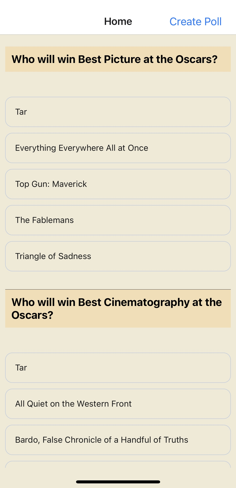
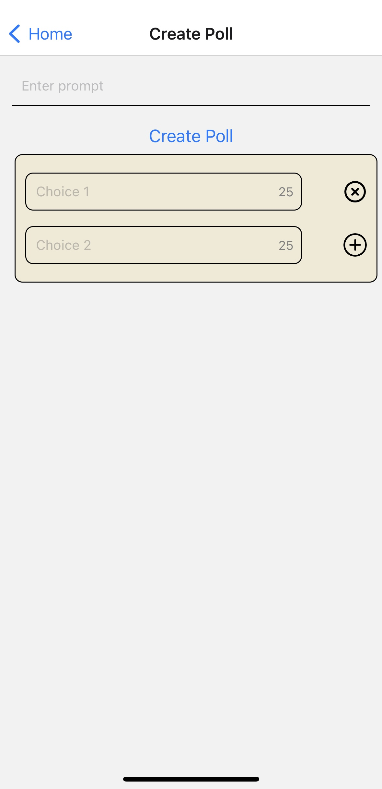

# YouPoll
Intitial MVVM architecture React Native polling app where users can view and create polls

How to run the app:
1. Run ``npm i`` in the root of the folder
2. Run ``npx expo start`` in the root of the folder

Future Work:
- implementing the createPoll hook
- using real-time poll data
- UX improvements, etc.

Screenshots:

